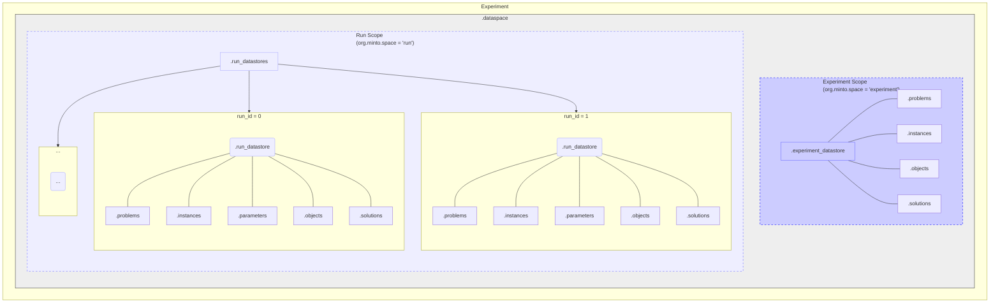

# Minto Core Concepts: Overview

## What is Minto?

Computational experiments, especially in optimization, generate a wealth of data: problem definitions, algorithm parameters, results, execution context, and more. Managing this data effectively is crucial for **reproducibility**, **analysis**, and **comparison**, but it quickly becomes complex. Ad-hoc methods are often inefficient and error-prone.

**Minto** is a library designed to bring structure and efficiency to this process. It helps you systematically **record, organize, and reuse** data from your experiments, ensuring that information is captured consistently and remains accessible.

## The Minto Data Structure: Experiment and Run Scopes

Minto organizes experimental data within a hierarchical structure, often managed by an `ExperimentDataSpace` object (representing the `.dataspace` concept). This structure clearly separates data based on its scope:

1.  **Experiment Scope (`org.minto.space = "experiment"`):** This part holds data that is **common across multiple runs** within a single conceptual experiment. Typically, this involves the definition of the problem(s) being solved.
2.  **Run Scope (`org.minto.space = "run"`):** This part holds data that is **specific to individual runs** (e.g., a single execution of an algorithm with a particular set of parameters). Each run gets its own record.

This two-level organization, illustrated below, is key to Minto's approach to efficient data management.

*(Figure: Minto Data Structure showing Experiment and Run scopes within a `.dataspace`)*

## Key Components Revisited

Based on this structure, let's refine our understanding of the key components:

* **`DataStore` (`.experiment_datastore` / `.run_datastore`):**
    * The **versatile container** for holding structured experimental data. It provides fields like `.problems`, `.instances`, `.parameters`, `.solutions`, `.objects` (and likely others like `.metadata`, `.samplesets` not shown in the simplified diagram).
    * Its specific role and content depend on its context within the `.dataspace`:
        * **Experiment DataStore:** Located in the 'experiment' scope, it primarily stores data common across runs, such as problem definitions (`.problems`, `.instances`).
        * **Run DataStore:** Located in the 'run' scope (within `.run_datastores`), each instance stores data for one specific run, crucially including the `.parameters` used and the resulting `.solutions`, potentially referencing common data from the experiment scope.
    * See [Mental Model of DataStore](./datastore.md) for more on its internal fields.

* **`ExperimentDataSpace` (Represents `.dataspace`):**
    * The **top-level manager** that implements and controls the two-level `experiment`/`run` structure.
    * It contains *both* the `.experiment_datastore` (for common data) and the collection of `.run_datastores` (for run-specific data).
    * It provides methods to add data to the correct scope (`.add()`) and to query/load data across runs (`.query()`, `.load_datastore()`, etc.), leveraging the organizational structure.
    * See the [Mental Model](../mental_model.md) guide for understanding its relationship with `DataStore`.

* **`log_xxx` Function Suite:**
    * The standard **mechanism for populating** the fields within *any* `DataStore`, whether it's an experiment-level or run-level one.
    * See [Logging Guide](../logging_guide.md).

## Data Organization Strategy: Efficiency via Separation

The core principle enabled by this structure is **storing data where it belongs**:

1.  **Common Data:** Information shared across many runs (e.g., the definition of a benchmark instance) is stored **once** in the `.experiment_datastore`.
2.  **Specific Data:** Information unique to a single run (e.g., the specific hyperparameter values tested, the resulting objective function value, logs) is stored in that run's dedicated `.run_datastore`.

This avoids redundant storage of potentially large common data, making the overall data footprint smaller and keeping the relationships between common inputs and specific results clear.

## Typical Workflow (Refined)

1.  **Initialize:** Create an `ExperimentDataSpace` for your experiment.
2.  **Log Common Data:** If there's data common to all planned runs (like a problem instance), create/get the `.experiment_datastore` associated with the `ExperimentDataSpace` and use `log_xxx` functions (e.g., `log_instance`) to populate it.
3.  **Iterate Through Runs:** For each experimental run:
    * Define the run-specific parameters.
    * Execute the experiment/algorithm.
    * Create a new **run `DataStore`** (Minto often handles this automatically when you `.add` run data to the `ExperimentDataSpace`).
    * Use `log_xxx` functions to record the specific `.parameters` and `.solutions` (or `.samplesets`) for *this run* into its `DataStore`. Associate it with a unique `run_id`.
4.  **Analyze:** Use the methods of the `ExperimentDataSpace` to query and load data, potentially combining information from the `.experiment_datastore` and various `.run_datastores` for comprehensive analysis and comparison.

## Benefits of Using Minto

* **Clear Structure:** Enforces a logical separation between experiment-wide and run-specific data.
* **Storage Efficiency:** Reduces redundancy by storing common data only once.
* **Improved Reproducibility:** Captures parameters and context for each run alongside results.
* **Powerful Analysis:** `ExperimentDataSpace` facilitates querying and aggregation across many runs.
* **Scalability:** Handles large numbers of runs within an organized framework.

## Next Steps

This overview, updated with the structural insights from your diagram, sets the stage. Continue exploring with:

* [Mental Model of DataStore](./datastore.md): Understand the fields available within a DataStore.
* [Mental Model](../mental_model.md): Further detail on how the organizer manages the units.
* [Logging Guide](../logging_guide.md): Practical examples of populating DataStores.
